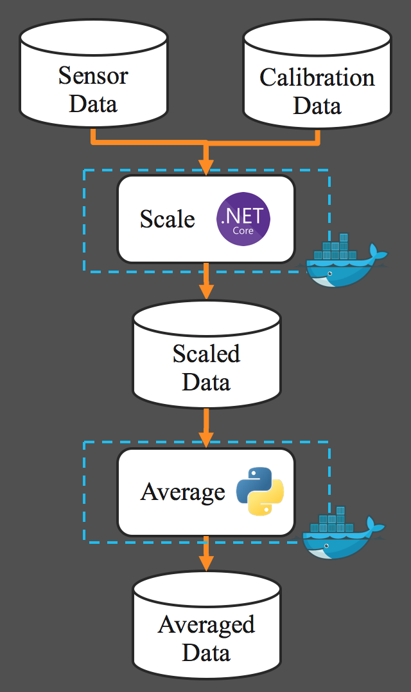

# Unlocking Fusion with Containers and Kubernetes

## Getting Started

1) Provision a Kubernetes cluster. The easiest way to do so is through [Minikube](https://kubernetes.io/docs/getting-started-guides/minikube/)
2) [Deploy Pachyderm](http://docs.pachyderm.io/en/latest/deployment/deploy_intro.html) onto the Kubernetes cluster. 
3) Run `demo-setup.sh` to seed the your Pachyderm instance with the necessary data
4) Step through line-by-line `demo.sh` to build an analysis pipeline

## Architecture

